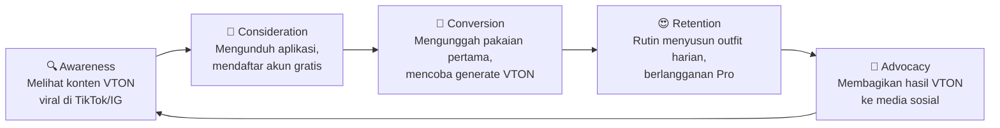

# Product Requirements Document (PRD)
**Nama Produk:** UrForm — Digital Wardrobe & AI Virtual Try-On
**Versi Dokumen:** 2.0
**Terakhir Diperbarui:** 31 Agustus 2026
**Status:** MVP Fase 1 Selesai · Fase 2 (Virtual Try-On) Dalam Perencanaan

---

## 1. Latar Belakang & Tujuan (Objective)

**Masalah:** Banyak orang memiliki banyak pakaian di lemari tetapi sering merasa bingung ("Paradox of Choice") saat harus memilih padu padan (*mix & match*) pakaian setiap harinya. Selain itu, belanja pakaian secara *online* sering kali berakhir kecewa karena pengguna tidak bisa membayangkan bagaimana pakaian tersebut akan terlihat di tubuh mereka sebelum membeli.

**Solusi:** Membangun aplikasi seluler bernama **UrForm** yang berfungsi sebagai:
1. **Lemari Digital (Digital Wardrobe):** Mendigitalkan pakaian nyata pengguna dengan menghapus latar belakang foto secara otomatis menggunakan AI.
2. **AI Virtual Try-On:** Memungkinkan pengguna "mencoba" pakaian dari lemari digital mereka secara fotorealistik di atas foto tubuh mereka sendiri, tanpa harus mengenakannya secara fisik.

---

## 2. Target Pengguna

- Individu berusia 18–35 tahun yang peduli dengan penampilan (*fashion-conscious*) tetapi memiliki keterbatasan waktu.
- Pengguna yang sering berbelanja pakaian secara *online* dan ingin memvisualisasikan tampilan pakaian sebelum membeli.
- Individu yang ingin mengorganisir lemari pakaian mereka secara digital dan mendapatkan inspirasi gaya harian.

---

## 3. Spesifikasi Teknis (Tech Stack)

Aplikasi dibangun menggunakan arsitektur terpisah antara *Mobile Frontend*, *AI Background Removal*, dan *AI Virtual Try-On*.

### 3.1. Frontend (Mobile App)

| Komponen | Teknologi |
|---|---|
| Framework | Flutter (Dart) |
| State Management | Riverpod (`flutter_riverpod`) |
| UI/UX | Material Design · Dark Mode kustom (Hitam & Amber) |
| Koneksi Database | `supabase_flutter` |
| Integrasi Hardware | `image_picker` (Kamera & Galeri Android) |
| Networking | `http` & `http_parser` untuk *Multipart Image Upload* |

### 3.2. Backend AI — Background Removal

| Komponen | Teknologi |
|---|---|
| Framework | Python · FastAPI (`uvicorn`) |
| AI Library | `rembg` (Machine Learning untuk *background removal* otomatis) |
| Endpoint | `POST /remove-background` — Menerima file gambar dan mengembalikan PNG transparan |
| Hosting | Berjalan secara lokal di komputer *host* (laptop pengembang) |

### 3.3. Backend AI — Virtual Try-On (Fase 2)

> [!IMPORTANT]
> Laptop pengembang (Lenovo LOQ) menggunakan GPU **Intel Arc** yang tidak mendukung arsitektur **NVIDIA CUDA**. Oleh karena itu, rencana server lokal untuk VTON telah **dibatalkan**. Infrastruktur *e-business* harus dirancang secara tepat untuk mendukung transaksi dan meningkatkan efisiensi operasional tanpa membebani perangkat keras yang tidak sesuai.

| Komponen | Teknologi |
|---|---|
| Model AI | IDM-VTON atau OOTDiffusion (Generative AI untuk *virtual fitting*) |
| Endpoint | `POST /virtual-tryon` — Menerima foto badan + foto pakaian, mengembalikan foto hasil *fitting* |
| Hosting | **Menggunakan Cloud Inference API (Hugging Face / Gradio Client).** Model AI dijalankan di server cloud pihak ketiga, bukan di perangkat lokal. |
| Rate Limiting | Pengguna Freemium dibatasi **3x generate/hari**. Pengguna Pro mendapat akses tanpa batas. |

### 3.4. Backend BaaS (Database, Auth & Storage)

| Komponen | Teknologi |
|---|---|
| Provider | Supabase |
| Database | PostgreSQL (Relasional) |
| Storage | Supabase Storage Bucket (`clothing_images`, `vton_results`) |
| Realtime | Supabase Realtime (WebSockets) untuk sinkronisasi otomatis |
| Keamanan | Row-Level Security (RLS) di seluruh tabel dan *bucket* |
| Autentikasi | Supabase Auth (Email/Password) |

---

## 4. Skema Database (Supabase PostgreSQL)

| Nama Tabel | Deskripsi | Kolom Utama |
|---|---|---|
| `profiles` | Profil, data tubuh, dan kontrol kuota harian pengguna. Otomatis dibuat via *Trigger* saat registrasi. | `id` (UUID), `email`, `height_cm`, `weight_kg`, `body_type`, `vton_daily_count` (INT, default 0), `last_vton_date` (DATE), `is_pro` (BOOLEAN, default false), `created_at` |
| `clothing_items` | Inventaris pakaian satuan milik pengguna. | `id`, `user_id` (FK), `category` (Baju, Celana, Sepatu, dll), `occasion_label` (Kerja, Main, Formal, dll), `image_url`, `created_at` |
| `outfits` | Riwayat hasil *generate* Virtual Try-On. | `id`, `user_id` (FK), `body_photo_url`, `clothing_item_id` (FK), `result_image_url`, `is_favorite` (Boolean), `created_at` |

#### Mekanisme Rate Limiting (Rem Darurat Kuota)

Untuk menekan biaya operasional API cloud eksternal, sistem menerapkan pembatasan *generate* harian:

```
┌─────────────────────────────────────────────────────────────────┐
│  Pengguna klik "Generate VTON"                                  │
│  ┌──────────────────────────┐                                   │
│  │ Cek: last_vton_date      │                                   │
│  │ == hari ini?             │                                   │
│  └──────┬───────────────────┘                                   │
│     Ya  │           Tidak                                       │
│         ▼           ▼                                           │
│  ┌──────────┐  ┌──────────────────┐                             │
│  │ Cek:     │  │ Reset counter:   │                             │
│  │ count<3? │  │ vton_daily_count │                             │
│  │ atau Pro │  │ = 0              │                             │
│  └──┬───┬──┘  │ last_vton_date   │                             │
│  Ya │   │Tidak│ = hari ini       │                             │
│     ▼   │     └────────┬─────────┘                             │
│  ✅ Proses│             │                                       │
│  Generate │             ▼                                       │
│  count++  │       ✅ Proses Generate                            │
│           │          count = 1                                  │
│           ▼                                                     │
│     🚫 Pop-up:                                                  │
│     "Kuota habis! Upgrade ke UrForm Pro                         │
│      untuk generate tanpa batas."                               │
└─────────────────────────────────────────────────────────────────┘
```

| Kolom Baru di `profiles` | Tipe | Fungsi |
|---|---|---|
| `vton_daily_count` | `INTEGER` (default: 0) | Menghitung berapa kali pengguna sudah *generate* VTON hari ini. |
| `last_vton_date` | `DATE` | Tanggal terakhir pengguna melakukan *generate*. Digunakan untuk mereset *counter* saat hari berganti. |
| `is_pro` | `BOOLEAN` (default: false) | Jika `true`, pengguna adalah pelanggan Pro dan melewati semua batas kuota. |

---

## 5. Fitur Utama (Core Features)

### 5.1. Masuk & Dasbor Profil (Pusat Kontrol)

> [!NOTE]
> Fitur ini didukung penuh oleh **Supabase Auth** dan mengamankan data lemari tiap pengguna.

- Saat pertama kali dibuka, pengguna **harus mendaftar atau login** terlebih dahulu.
- Setelah masuk, **Tab Profil (Ikon Orang)** berfungsi sebagai **Dasbor Pribadi**, bukan halaman sosial media.
- Di dalam Dasbor, pengguna dapat mengatur **"Body Profile":**
  - **Tinggi Badan** (cm)
  - **Berat Badan** (kg)
  - **Bentuk Tubuh** (Ectomorph / Mesomorph / Endomorph)
  - Data ini nantinya akan membantu meningkatkan akurasi AI Virtual Try-On.
- Dasbor juga menampilkan **statistik gamifikasi:**
  - Total pakaian di lemari.
  - Riwayat jumlah *outfit* yang telah di-*generate*.
  - Jumlah *outfit* favorit yang disimpan.

---

### 5.2. Tambah Pakaian ke Lemari Terkategori

- Tekan **Ikon PLUS (+) di tengah bawah layar Navbar** untuk menambahkan pakaian baru.
- Pengguna memotret atau memilih gambar dari galeri.
- Foto dikirim ke **API Python lokal** → AI `rembg` menghapus latar belakang → Hasil PNG transparan disimpan ke **Supabase Storage**.
- Setelah diunggah, pengguna masuk ke **Halaman Kategori Detail.** Pengguna **wajib mengelompokkan** item secara spesifik:

| Kelompok Kategori | Contoh Item |
|---|---|
| Atasan | Baju, Kaos, Kemeja, Jaket, Hoodie |
| Bawahan | Celana Panjang, Celana Pendek, Rok |
| Alas Kaki | Sepatu, Sandal, Boots |
| Aksesoris Kepala | Topi, Kacamata |
| Aksesoris Tangan | Cincin, Gelang, Jam Tangan |
| Aksesoris Leher | Kalung, Dasi, Syal |
| Aksesoris Telinga | Anting |
| Aksesoris Kaki | Kaos Kaki |
| Aksesoris Lainnya | Tas, Sabuk, Dompet |

- Pengguna juga dapat menambahkan **Label Acara (Kategori Pemakaian),** misalnya:
  - `Kerja` · `Main` · `Formal` · `Olahraga` · `Jalan-Jalan` · `Santai`

---

### 5.3. Jelajahi Etalase Lemari (Gudang Data)

- Buka **Tab Lemari (Ikon Laci/Gantungan).**
- Seluruh pakaian pengguna yang sudah diunggah ditampilkan dengan rapi **berdasarkan kelompok kategori detail** yang dipilih pada langkah 5.2.
- Data tersinkronisasi secara **real-time** menggunakan Supabase Realtime (WebSockets).
- Mendukung **Offline Mode** (caching lokal) agar pengguna tetap bisa melihat isi lemari mereka tanpa internet.

---

### 5.4. Generator AI Virtual Try-On (Etalase Bintang)

> [!IMPORTANT]
> Inilah keajaiban utama dari UrForm. Fitur ini membutuhkan server AI lokal dengan GPU yang cukup kuat.

- Buka **Tab Etalase (Ikon Bintang).**
- Di halaman ini, terdapat **tombol "+" besar** khusus untuk menu **Generate Photo.**
- **Alur Generate:**
  1. Pengguna memilih **foto seluruh badan (*body shot*)** dari galeri atau kamera.
  2. Pengguna memilih **pakaian dari lemari** yang ingin "dicoba."
  3. Data (foto badan + foto pakaian transparan) dikirim ke **server AI lokal** yang menjalankan model **IDM-VTON** atau **OOTDiffusion.**
  4. AI akan meracik dan **memakaikan baju tersebut ke badan pengguna secara fotorealistik.**
  5. Sistem mengarahkan pengguna ke **Halaman Hasil Generate.**
  6. Jika puas, pengguna menekan **Ikon Love/Favorite** untuk menyimpan hasilnya.

---

### 5.5. Koleksi Favorit (Etalase Love)

- Buka **Tab Favorit (Ikon Hati).**
- Etalase ini khusus memuat galeri **hasil foto Virtual Try-On** yang sudah di-*generate* dan **diberi tanda Love** oleh pengguna.
- Ini menjadi **katalog inspirasi gaya harian** mereka — tempat melihat kembali penampilan terbaik yang sudah disetujui.

---

## 6. Panduan Desain (UI/UX Guidelines)

- **Tema Utama:** *Dark Mode* (Latar belakang dominan `Colors.black`).
- **Aksen:** Emas/Amber (`Colors.amber`) untuk ikon, status aktif, dan garis tepi (*borders*).
- **Layout:** Gaya *grid* minimalis yang bersih, terinspirasi dari struktur katalog digital premium modern.
- **Navigasi (Navbar) — 5 Titik:**

| Posisi | Ikon | Fungsi |
|---|---|---|
| Kiri 1 | ⭐ Bintang | Etalase (Virtual Try-On Generator) |
| Kiri 2 | ❤️ Hati | Favorit (Koleksi Hasil VTON) |
| Tengah | ➕ Plus (FAB) | Tambah Pakaian Baru ke Lemari |
| Kanan 1 | 👔 Gantungan | Lemari (Gudang Data Pakaian) |
| Kanan 2 | 👤 Orang | Dasbor Profil |

---

## 7. Kebijakan Keamanan Aplikasi (Security Policy)

> [!CAUTION]
> Bagian ini adalah **pedoman wajib** yang harus dipatuhi oleh seluruh tim pengembang (termasuk AI asisten) dalam setiap fase pengembangan. Setiap perubahan kode yang menyentuh area keamanan **WAJIB dikonfirmasikan terlebih dahulu** kepada pemilik proyek sebelum dieksekusi.

### 7.1. API Key & Secret (PIN Brankas)

| Aturan | Deskripsi |
|---|---|
| **Jangan hardcode kredensial** | Semua API key, secret, dan URL sensitif harus disimpan di file `.env` lokal atau di-*inject* saat build time (`--dart-define`). |
| **Jangan masukkan `.env` ke assets** | File `.env` TIDAK BOLEH didaftarkan di `pubspec.yaml` sebagai aset. Siapapun bisa membongkar APK dan membacanya. |
| **Pisahkan key publik dan rahasia** | Hanya key yang memang dirancang untuk klien (seperti Supabase `anon_key`) yang boleh dipakai di sisi frontend. Key master (`service_role`) TIDAK BOLEH pernah menyentuh kode klien. |
| **Buat `.env.example`** | Sediakan file `.env.example` tanpa nilai asli sebagai template untuk developer lain. |

### 7.2. Proteksi Repository (`.gitignore`)

| Aturan | Deskripsi |
|---|---|
| **Wajib ada `.env` di `.gitignore`** | Sebelum menjalankan `git add .`, pastikan baris `.env`, `.env.*`, dan `*.env` sudah tertulis di file `.gitignore` (baik di root maupun subfolder). |
| **Anggap bocor = permanen** | Jika `.env` pernah ter-commit ke GitHub meskipun sudah dihapus, riwayat Git tetap menyimpannya. Bot peretas memindai GitHub 24/7. Jika terlanjur bocor, **ganti semua key** tanpa terkecuali. |

### 7.3. Rate Limiting (Pembatasan Kecepatan)

| Aturan | Deskripsi |
|---|---|
| **Setiap endpoint berat wajib dibatasi** | Endpoint yang memproses AI/ML (seperti `rembg`, VTON) harus dibatasi jumlah request per menit per IP untuk mencegah serangan DoS dan lonjakan biaya. |
| **Gunakan middleware** | Gunakan library seperti `slowapi` (FastAPI) atau middleware bawaan hosting untuk menerapkan pembatasan secara otomatis. |
| **Terapkan kuota bisnis** | Untuk fitur berbayar (VTON), terapkan mekanisme `vton_daily_count` di database agar pengguna freemium tidak menyalahgunakan kuota. |

### 7.4. Input Validation & Sanitize (Jangan Percaya Input Pengguna)

| Aturan | Deskripsi |
|---|---|
| **Validasi tipe file** | Setiap endpoint yang menerima file upload WAJIB memvalidasi MIME type (`image/jpeg`, `image/png`, `image/webp`) dan menolak tipe lainnya. |
| **Batasi ukuran file** | Terapkan batas ukuran maksimal (contoh: 10MB) untuk mencegah serangan *memory exhaustion*. |
| **Verifikasi integritas** | Gunakan *magic bytes* atau library seperti Pillow `.verify()` untuk memastikan file benar-benar gambar, bukan file berbahaya yang disamarkan. |
| **Sanitize input teks** | Validasi format email (regex), panjang minimum password, dan bersihkan karakter berbahaya (`<script>`, SQL injection) dari setiap input form. |

### 7.5. Authentication di Protected Route (Kunci Pintu)

| Aturan | Deskripsi |
|---|---|
| **Auth Guard Global** | Aplikasi WAJIB mengecek status login pengguna di level navigasi utama (`main.dart`). Jika belum login, pengguna harus dialihkan ke halaman login — bukan hanya menyembunyikan tombol UI. |
| **Filter query berdasarkan `user_id`** | Setiap query database yang menampilkan data pribadi (pakaian, outfit) WAJIB menyertakan filter `.eq('user_id', user.id)` agar User A tidak melihat data User B. |
| **Aktifkan RLS di Supabase** | Row-Level Security (RLS) harus aktif di SEMUA tabel dan storage bucket sebagai pertahanan lapis kedua. |
| **Hindari force unwrap (`!`)** | Jangan gunakan `currentUser!` tanpa pengecekan null terlebih dahulu. Gunakan `if (user == null) return;`. |

### 7.6. Error Message (Jangan Bocorkan Rahasia Server)

| Aturan | Deskripsi |
|---|---|
| **Pesan error generik untuk pengguna** | Tampilkan pesan ramah seperti *"Maaf, terjadi kesalahan. Silakan coba lagi."* di UI. JANGAN tampilkan objek exception mentah (`$e`, `str(e)`) ke layar pengguna. |
| **Log error asli di server** | Detail error teknis (stack trace, path server, nama library) hanya boleh dicatat ke sistem logging internal, bukan diekspos ke response API atau SnackBar Flutter. |
| **Matikan debug mode di produksi** | Pastikan `kReleaseMode` di Flutter dan environment variable `ENV=production` di Python aktif saat rilis. |

### 7.7. Debug & Docs Endpoint (Tutup Pintu Belakang)

| Aturan | Deskripsi |
|---|---|
| **Hapus endpoint uji coba** | Setiap rute testing (contoh: `/api/test-login-admin`, `/debug`) WAJIB dihapus atau dinonaktifkan sebelum rilis. |
| **Nonaktifkan Swagger/ReDoc** | Halaman `/docs`, `/redoc`, dan `/openapi.json` di FastAPI harus dimatikan di mode produksi agar peta API tidak bisa dibaca pihak luar. |

### 7.8. Logging (CCTV Digital)

| Aturan | Deskripsi |
|---|---|
| **Setiap request harus tercatat** | Gunakan modul `logging` Python (atau Firebase Crashlytics di Flutter) untuk mencatat siapa yang memanggil API, dari IP mana, kapan, dan hasilnya (berhasil/gagal). |
| **Log harus tersimpan** | Jangan hanya cetak ke console. Simpan log ke file atau layanan eksternal agar bisa ditelusuri jika terjadi insiden keamanan. |

### 7.9. Dependency Management (Rantai Pasok)

| Aturan | Deskripsi |
|---|---|
| **Kunci versi dependensi** | File `requirements.txt` (Python) WAJIB mencantumkan versi minimum (contoh: `fastapi>=0.115.0`). Jangan biarkan kosong (*unpinned*) karena bisa menarik versi yang sudah dikompromikan. |
| **Audit berkala** | Jalankan `npm audit` (Node.js) atau `pip audit` (Python) secara rutin untuk memeriksa kerentanan pada library pihak ketiga. |

### 7.10. CORS (Penjaga Gerbang Lintas Domain)

| Aturan | Deskripsi |
|---|---|
| **Jangan pakai wildcard `*`** | Konfigurasi CORS harus secara eksplisit menyebutkan domain yang diizinkan, bukan membuka akses untuk semua origin. |
| **Batasi metode HTTP** | Hanya izinkan metode yang diperlukan (contoh: `GET`, `POST`). Tolak `DELETE`, `PUT` jika tidak dibutuhkan. |

### 7.11. Blind Spot Tambahan

| Aturan | Deskripsi |
|---|---|
| **Signing Config Produksi** | Build `release` Android WAJIB menggunakan *keystore* produksi sendiri, bukan *debug signing config* bawaan. |
| **HTTPS Everywhere** | Semua komunikasi antara aplikasi dan server API WAJIB menggunakan HTTPS (terenkripsi), bukan HTTP biasa. |
| **Data Privasi Pengguna** | Data sensitif (tinggi, berat, foto badan) memerlukan kebijakan privasi yang jelas dan penyimpanan terenkripsi. |

---

# BAGIAN II: STRATEGI BISNIS & E-COMMERCE

---

## Bab A: Analisis Pasar & Kompetitor (Market Analysis)

### A.1. Definisi Ukuran Pasar (SOM — Serviceable Obtainable Market)

| Level | Definisi | Estimasi |
|---|---|---|
| **TAM** (Total Addressable Market) | Seluruh pengguna *smartphone* di Indonesia yang peduli *fashion* (usia 18–35 tahun). | ~65 juta pengguna |
| **SAM** (Serviceable Available Market) | Pengguna yang aktif menggunakan aplikasi *fashion/lifestyle* dan berbelanja pakaian secara *online*. | ~15 juta pengguna |
| **SOM** (Serviceable Obtainable Market) | Target realistis yang bisa dijangkau UrForm dalam 1–2 tahun pertama: pengguna *tech-savvy* di kota besar (Jakarta, Bandung, Surabaya, Yogyakarta) yang aktif di Instagram/TikTok dan tertarik dengan teknologi AI. | **~50.000 – 150.000 pengguna** |

### A.2. Analisis SWOT

| | **Positif** | **Negatif** |
|---|---|---|
| **Internal** | **Strengths (Kekuatan)** | **Weaknesses (Kelemahan)** |
| | ✅ Teknologi AI Virtual Try-On yang masih sangat langka di pasar Indonesia. | ⚠️ Membutuhkan GPU kuat untuk menjalankan model VTON secara lokal. |
| | ✅ Penghapusan latar belakang otomatis membuat pengalaman pengguna sangat mulus. | ⚠️ Ketergantungan pada koneksi ke server lokal (belum sepenuhnya *cloud-based*). |
| | ✅ Gratis untuk pengguna di tahap awal (tidak ada biaya API *cloud*). | ⚠️ Basis pengguna masih nol; perlu strategi akuisisi yang agresif. |
| **Eksternal** | **Opportunities (Peluang)** | **Threats (Ancaman)** |
| | 🚀 Tren *AI-powered fashion* sedang naik pesat secara global. | 🔴 Kompetitor besar seperti Google (Shopping Try-On) dan Zalora/Shopee berpotensi merilis fitur serupa. |
| | 🚀 Potensi kolaborasi dengan brand *fashion* lokal untuk monetisasi B2B. | 🔴 Biaya migrasi ke *cloud GPU* (AWS/GCP) bisa sangat mahal jika pengguna melonjak. |
| | 🚀 Konten UGC (User-Generated Content) dari hasil VTON sangat *shareable* di media sosial. | 🔴 Isu privasi data tubuh pengguna (tinggi, berat, foto badan) memerlukan kebijakan ketat. |

---

## Bab B: Model Bisnis & Proyeksi Keuangan (Financial Projections)

### B.1. Model Pendapatan (Revenue Models)

| Model | Deskripsi | Estimasi Harga |
|---|---|---|
| **Freemium** | Pengguna gratis mendapat akses penuh ke fitur Lemari Digital dan 3x *generate* VTON per hari. | Rp 0 |
| **UrForm Pro (Langganan Bulanan)** | Fitur VTON tanpa batas, akses prioritas server AI, fitur rekomendasi outfit berdasarkan cuaca & bentuk tubuh, dan *badge* profil eksklusif. | Rp 29.900/bulan atau Rp 249.900/tahun |
| **UrForm Business (B2B)** | API Virtual Try-On untuk *e-commerce fashion* lokal agar pelanggan toko mereka bisa mencoba baju sebelum membeli. | Negosiasi per klien |
| **Konten Bermerek (Sponsored)** | Brand *fashion* dapat membayar agar produk mereka muncul sebagai "Rekomendasi Harian" di Etalase pengguna. | Per kampanye (CPM/CPC) |

### B.2. Struktur Biaya (Cost Structure)

| Pos Pengeluaran | Estimasi Bulanan | Catatan |
|---|---|---|
| **Supabase (Database & Auth)** | Rp 0 – Rp 375.000 | Tier gratis cukup untuk 50.000 MAU. Pro Plan ~$25/bulan jika melampaui. |
| **Cloud GPU (Saat Migrasi)** | Rp 1.500.000 – Rp 7.500.000 | RunPod/Vast.ai untuk hosting model VTON. Biaya sangat bergantung pada jumlah *request*. |
| **Hugging Face API (Alternatif)** | Rp 0 – Rp 750.000 | Jika menggunakan *Inference API* alih-alih self-hosted. Tier gratis terbatas. |
| **Domain & CDN** | Rp 150.000 | Untuk landing page dan distribusi aset gambar. |
| **Google Play Console** | Rp 375.000 (sekali bayar) | Biaya pendaftaran akun developer. |
| **Total Estimasi Awal** | **~Rp 2.000.000 – Rp 8.700.000/bulan** | Sebelum pendapatan; bisa ditekan jika server tetap lokal. |

### B.3. Break-Even Analysis (Titik Impas)

> [!TIP]
> Dengan biaya operasional ~Rp 5.000.000/bulan dan harga langganan Rp 29.900/bulan, UrForm membutuhkan **~167 pelanggan Pro aktif** untuk mencapai titik impas (*break-even*). Target ini realistis dicapai dalam 6–12 bulan pertama dengan strategi pemasaran yang tepat.

---

## Bab C: Customer Relationship Management (CRM)

### C.1. Customer Journey Map



| Tahap | Strategi CRM |
|---|---|
| **Awareness** | Konten viral di TikTok & Instagram Reels menunjukkan keajaiban AI Virtual Try-On. |
| **Consideration** | Landing page dengan demo interaktif. Testimoni pengguna awal. |
| **Conversion** | Onboarding yang mulus: daftar → unggah 1 baju → generate 1 VTON dalam < 3 menit. |
| **Retention** | Push notification harian: *"Sudah siapkan outfit untuk besok?"* Statistik gamifikasi di Dasbor. |
| **Advocacy** | Tombol "Bagikan ke Instagram Story" langsung dari halaman hasil VTON. Fitur watermark UrForm otomatis. |

### C.2. Notifikasi & Reactivation Strategy

| Jenis Notifikasi | Waktu | Tujuan |
|---|---|---|
| **Daily Reminder** | Setiap pukul 21:00 WIB | *"Hei! Sudah siapkan outfit untuk besok pagi? 👔"* — Mendorong kebiasaan harian. |
| **Weekly Recap** | Setiap Minggu pagi | *"Minggu ini kamu sudah membuat 5 outfit! Coba buat 1 lagi? 🏆"* — Gamifikasi. |
| **Reactivation (7 hari tidak aktif)** | Hari ke-7 setelah terakhir buka | *"Lemari kamu rindu... Ada 3 baju baru yang belum dicoba! 😢"* — Win-back. |
| **Promo Langganan** | Setelah 10x generate gratis | *"Suka hasilnya? Upgrade ke Pro untuk generate tanpa batas! 🚀"* — Upselling. |

---

## Bab D: Marketing & Content Plan

### D.1. Kanal Pemasaran Digital

| Kanal | Strategi | Target Metrik |
|---|---|---|
| **TikTok** | Video pendek "Before vs After" VTON yang *satisfying*. Gunakan tren audio viral. | 500K views/bulan dalam 3 bulan pertama. |
| **Instagram Reels & Stories** | Carousel tips *mix & match* + hasil VTON. Kolaborasi dengan *micro-influencer* fashion (1K–50K followers). | 10K followers dalam 6 bulan. |
| **YouTube Shorts** | Tutorial singkat: "Cara Digitalisasi Lemari Baju Kamu dalam 5 Menit." | 100K views dalam 6 bulan. |
| **Google Play Store (ASO)** | Optimasi kata kunci: "virtual try on", "outfit generator", "lemari digital", "AI fashion". | Top 10 di kategori Lifestyle Indonesia. |

### D.2. Strategi Konten (Content Plan)

| Tipe Konten | Frekuensi | Deskripsi |
|---|---|---|
| **UGC (User-Generated Content)** | Harian | Pengguna membagikan hasil generate VTON ke media sosial dengan hashtag `#UrFormStyle`. Konten terbaik di-repost di akun resmi. |
| **Video Tutorial** | 2x/minggu | "Cara Mengunggah Baju", "Cara Generate Outfit AI", "Tips Body Profile untuk Hasil VTON Terbaik." |
| **Kolaborasi Influencer** | 2x/bulan | Kirim akses Pro ke fashion *micro-influencer* → mereka membuat konten review. |
| **Behind the Tech** | 1x/bulan | Thread/post tentang bagaimana teknologi AI di balik UrForm bekerja. Menarik audiens *tech-savvy*. |
| **Challenge Campaign** | 1x/bulan | Challenge bulanan: *"Buat 7 outfit dalam 7 hari"* → pemenang dapat hadiah/merchandise. |

### D.3. Unique Selling Proposition (USP)

> [!IMPORTANT]
> **"UrForm — Coba Baju Tanpa Harus Memakainya."**
>
> Satu-satunya aplikasi lemari digital di Indonesia yang dilengkapi teknologi AI Virtual Try-On fotorealistik. Digitalkan pakaianmu, racik gayamu, dan lihat hasilnya langsung di tubuhmu — semua dari genggaman tanganmu.

---

## 8. Keputusan Final & Catatan Teknis

> [!NOTE]
> Keputusan-keputusan berikut telah disepakati dan menjadi pedoman pengembangan:
> 1. **Tombol PLUS (+)** di navbar sekarang berfungsi untuk **menambah pakaian**, bukan membuka outfit generator.
> 2. **Outfit Generator (VTON)** dipindahkan ke dalam **Tab Etalase (Bintang)** sebagai sub-fitur.
> 3. **Kategori Pakaian** dibuat lebih detail dan granular (bukan hanya 4 kelompok besar).
> 4. **Label Acara** (Kerja, Main, Formal, dll) ditambahkan untuk pemfilteran yang lebih cerdas.
> 5. **Body Profile** (Tinggi, Berat, Bentuk Tubuh) ditambahkan ke Dasbor Profil.
> 6. **AI Virtual Try-On** menggunakan model IDM-VTON atau OOTDiffusion yang berjalan di **Cloud Inference API (Hugging Face / Gradio Client)**, bukan secara lokal, karena keterbatasan GPU Intel Arc pada perangkat pengembang.
> 7. **Login** mendukung sistem Email/Password melalui Supabase Auth.
> 8. **Offline Mode** tetap diimplementasikan untuk menjelajahi Lemari tanpa internet.
> 9. **Kebijakan Keamanan (Bab 7)** adalah pedoman wajib. Setiap perubahan yang menyentuh area keamanan harus dikonfirmasi terlebih dahulu kepada pemilik proyek.

---

## 9. Rencana Pengembangan (Roadmap)

| Fase | Fitur | Status |
|---|---|---|
| Fase 1 (MVP) | Lemari Digital, Background Removal AI, Outfit Generator 2D Flatlay, Auth, Etalase & Favorit. | ✅ Selesai |
| Fase 1.5 (Security Hardening) | Perbaikan 10 poin keamanan: Auth Guard, Rate Limiting, Input Validation, `.gitignore`, Error Handling, Logging, CORS, Dependencies. | 🔜 **Sedang Dikerjakan** |
| Fase 2 | Refaktor navigasi, Halaman Kategori Detail, Label Acara, Body Profile di Dasbor. | 📋 Direncanakan |
| Fase 3 | Integrasi AI Virtual Try-On (IDM-VTON/OOTDiffusion) via Cloud Inference API. | 📋 Direncanakan |
| Fase 4 | Push Notification, Gamifikasi, Tombol "Bagikan ke Instagram". | 📋 Direncanakan |
| Fase 5 | Peluncuran Langganan Pro (Monetisasi), Optimasi Cloud GPU. | 📋 Direncanakan |
| Fase 6 | API B2B untuk E-Commerce Fashion, Kolaborasi Brand. | 📋 Direncanakan |
